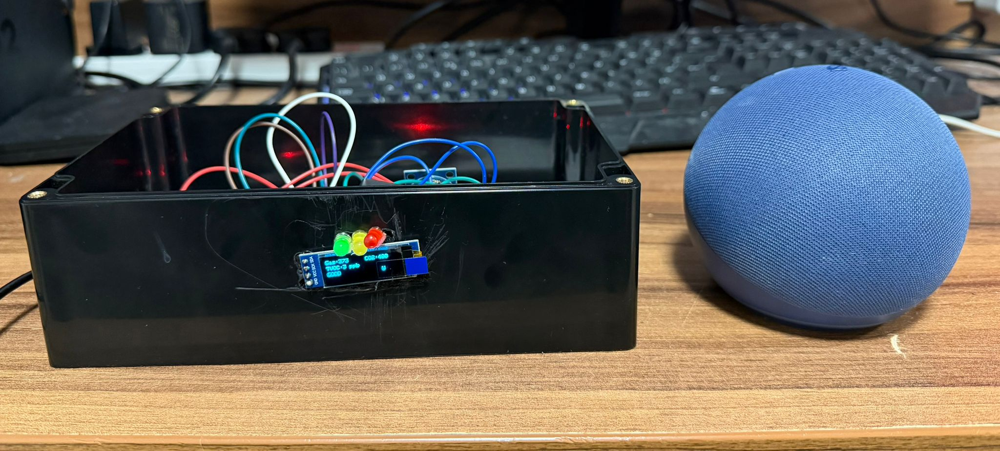
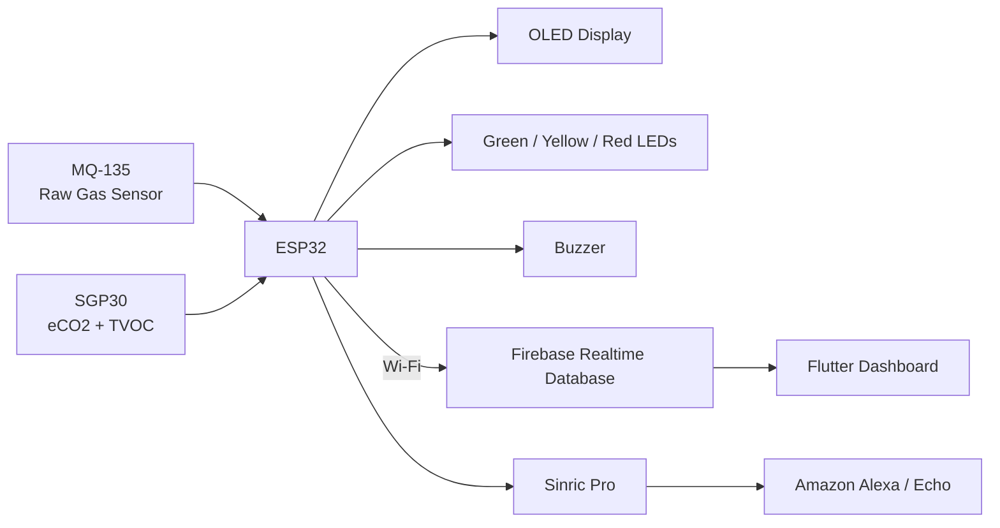
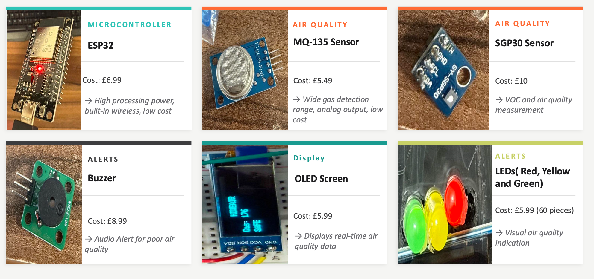
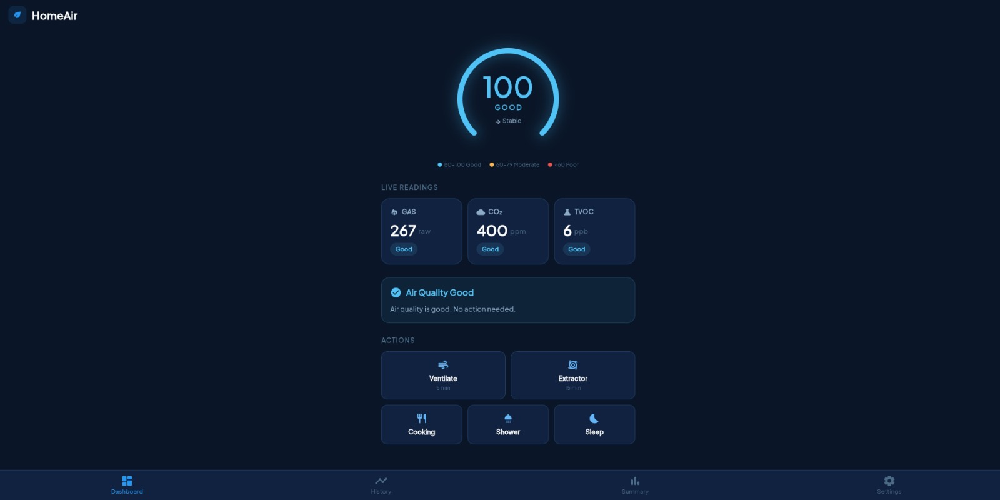
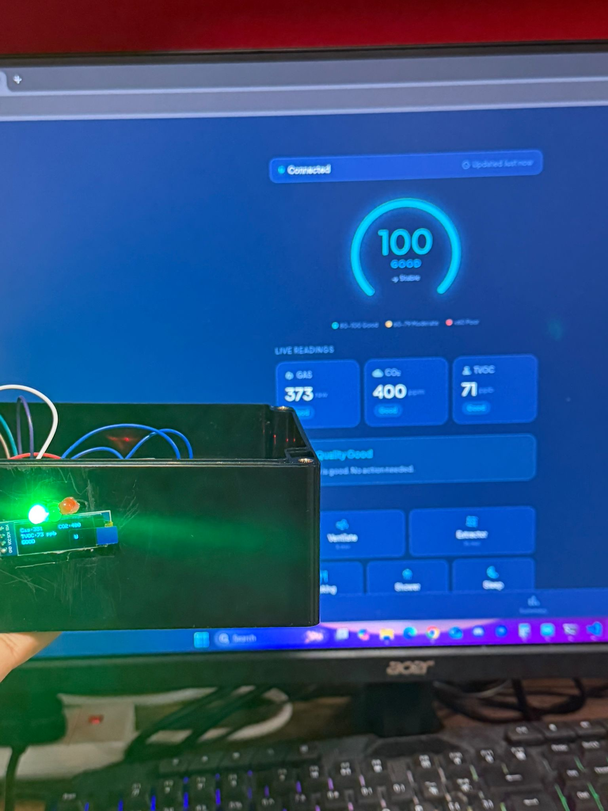
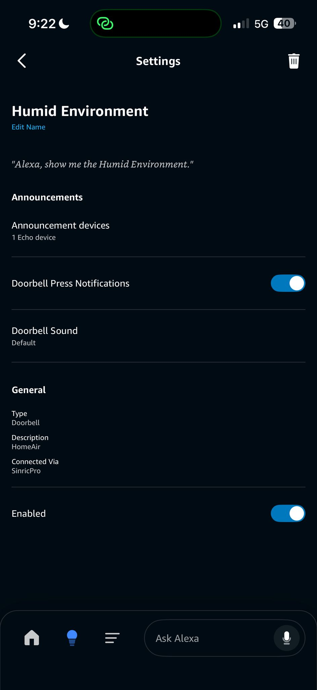
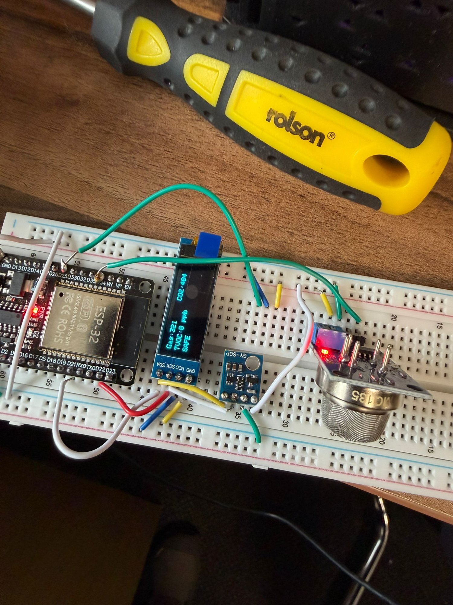
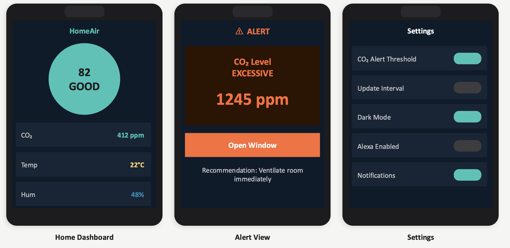
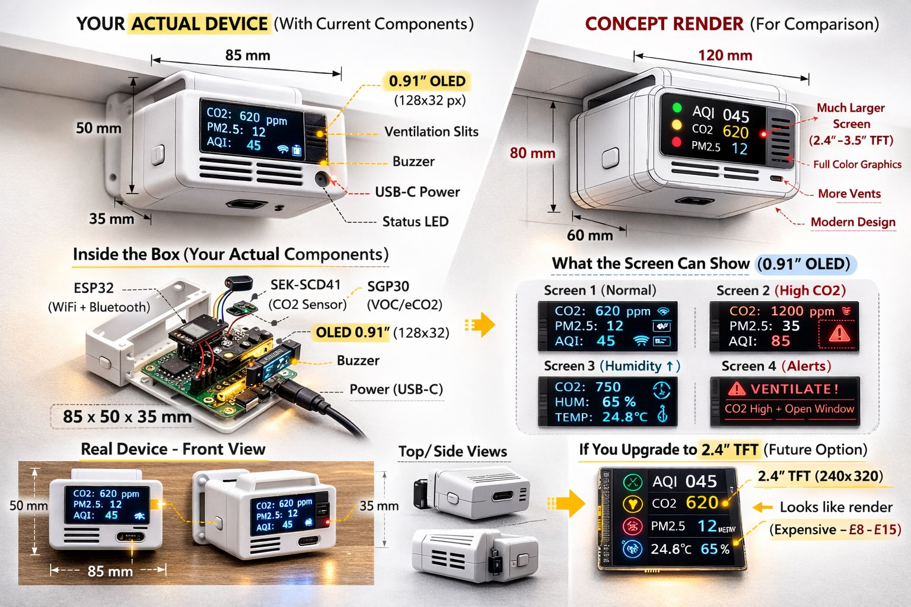

<p align="center">
  
</p>

<p align="center">
  <strong>Smart Indoor Air Quality Monitoring System</strong>
</p>

<p align="center">
  ESP32 · MQ-135 · SGP30 · Firebase · Flutter · Amazon Alexa
</p>

<p align="center">
  
  
  
  
</p>

<br>

<p align="center">
  
</p>

---

## Overview

**HomeAir** is a smart indoor air-quality monitoring prototype developed as a collaborative engineering design project at the **University of Greenwich**.

The system combines embedded sensors, an ESP32 microcontroller, local visual and audible feedback, cloud data storage, a real-time dashboard, and Amazon Alexa integration.

The final prototype demonstrates a complete IoT pipeline:

**Sensors → ESP32 → Local Alerts → Wi-Fi → Firebase → Dashboard → Alexa**

HomeAir was designed to provide users with clear, real-time information about indoor air conditions while remaining affordable, accessible, and easy to understand.

---

## Final Prototype

<p align="center">
  
</p>

The completed prototype integrates the sensing hardware, OLED display, status LEDs, ESP32 controller, and supporting electronics inside a physical project enclosure.

The system was successfully demonstrated alongside an Amazon Echo and a live HomeAir dashboard.

---

## Key Features

- Real-time indoor air-quality sensing
- ESP32-based embedded control
- MQ-135 analog gas monitoring
- SGP30 eCO₂ and TVOC measurement
- OLED display for local live readings
- Green, yellow, and red air-quality indicators
- Audible buzzer warnings
- Wi-Fi connectivity
- Firebase Realtime Database integration
- Timestamped historical data logging
- Live Flutter dashboard
- Amazon Alexa integration through Sinric Pro
- Automatic poor-air-quality alerts
- Local monitoring when cloud connectivity is unavailable
- Modular architecture for future expansion

---

## System Architecture



The firmware repeatedly acquires sensor data, classifies the current air-quality state, updates local outputs, synchronises cloud data, and triggers a voice alert when poor conditions are detected.

For a detailed implementation flow, see [`docs/HomeAir_Flowchart.pdf`](docs/HomeAir_Flowchart.pdf).

---

## Hardware

| Component | Purpose |
|---|---|
| ESP32 development board | Main controller, processing and Wi-Fi |
| MQ-135 | Broad-spectrum analog gas / air-quality indicator |
| SGP30 | Digital eCO₂ and TVOC measurements |
| SSD1306 OLED | Local live readings and system state |
| Green / Yellow / Red LEDs | Visual air-quality indication |
| Active buzzer | Local audible warning |
| Breadboard + jumper wiring | Prototype interconnection |
| ABS project enclosure | Physical prototype housing |
| Amazon Echo | Voice alert output |

<p align="center">
  
</p>

> **Measurement note:** the MQ-135 is treated as a **raw analog gas indicator** in this prototype. The SGP30 provides the digital eCO₂ and TVOC values used by the system.

---

## ESP32 Pin Mapping

| Function | ESP32 Pin |
|---|---:|
| MQ-135 analog output | GPIO34 |
| Buzzer signal | GPIO25 |
| Green LED | GPIO17 |
| Yellow LED | GPIO18 |
| Red LED | GPIO19 |
| I²C SDA | GPIO21 |
| I²C SCL | GPIO22 |
| OLED I²C address | 0x3C / 0x3D |
| SGP30 I²C address | 0x58 |

The prototype LEDs and buzzer use **active-low logic**, which is handled by the firmware.

More detail is available in [`docs/wiring-table.md`](docs/wiring-table.md).

---

## Firmware Operation

The ESP32 firmware follows this high-level sequence:

1. Initialise the ESP32, sensors, OLED, LEDs and buzzer.
2. Connect to Wi-Fi.
3. Initialise Sinric Pro / Alexa integration.
4. Read MQ-135 and SGP30 values.
5. Classify air quality as **GOOD**, **MODERATE**, or **BAD**.
6. Update OLED, LEDs and buzzer.
7. Trigger Alexa when a poor-air condition is detected.
8. Upload the latest reading and historical sample to Firebase.
9. Repeat continuously.

Sensor acquisition runs approximately every **1 second**, while Firebase synchronisation occurs every **5 seconds**.

---

## Air-Quality States

| State | Local Output | Behaviour |
|---|---|---|
| **GOOD** | Green LED | Normal monitoring |
| **MODERATE** | Yellow LED | Warning indication |
| **BAD** | Red LED | Buzzer + alert logic |

The SGP30 eCO₂ reading is also checked independently against a configured threshold.

---

## Dashboard

<p align="center">
  
</p>

The HomeAir dashboard provides a live visual interface for sensor data transmitted by the ESP32. It presents:

- overall air-quality status
- raw gas reading
- eCO₂ concentration
- TVOC concentration
- connection state
- contextual recommendations
- historical data views

A final live test confirmed synchronisation between the physical HomeAir device and the dashboard.

<p align="center">
  
</p>

---

## Firebase Integration

The ESP32 sends structured JSON data to **Firebase Realtime Database**.

Two logical data paths are used:

```text
/latest
```

Stores the newest available reading for real-time display.

```text
/readings
```

Stores timestamped historical samples.

A typical payload has the following shape:

```json
{
  "gasRaw": 267,
  "co2ppm": 400,
  "tvoc": 6,
  "airLevel": 0,
  "timestamp": 0
}
```

---

## Amazon Alexa Integration

<p align="center">
  
</p>

HomeAir integrates with **Amazon Alexa using Sinric Pro**.

When a poor-air-quality condition is detected, the ESP32 can trigger a Sinric Pro event that is announced through a linked Amazon Echo device. A cooldown mechanism prevents repeated alerts while the same condition persists.

---

## Prototype Development

<p align="center">
  
</p>

HomeAir was developed iteratively:

**Problem research → concept development → component selection → breadboard prototype → sensor integration → OLED / LED / buzzer integration → Wi-Fi → Firebase → dashboard → Alexa → enclosure → final testing**

This allowed each subsystem to be validated before complete end-to-end integration.

---

## User Interface Concept

<p align="center">
  
</p>

The original interface concept focused on presenting environmental information clearly without overwhelming the user. It included a dashboard, alert view, ventilation recommendations, and settings for notifications and Alexa functionality.

---

## Future Product Concept

<p align="center">
  
</p>

The concept render above illustrates how HomeAir could evolve from an engineering prototype into a more compact consumer product.

**It is a concept render, not a photograph of the final prototype.**

Potential future improvements include a custom PCB, compact enclosure, larger display, dedicated temperature/humidity sensing, and a calibrated NDIR CO₂ sensor.

---

## Software Stack

| Layer | Technology |
|---|---|
| Embedded controller | ESP32 |
| Firmware | C / C++ |
| Sensor communication | ADC + I²C |
| Wireless networking | Wi-Fi |
| Cloud database | Firebase Realtime Database |
| Dashboard | Flutter |
| Voice integration | Sinric Pro |
| Smart-home platform | Amazon Alexa |
| Local display | SSD1306 OLED |

---

## Security

**No real credentials should be committed to this repository.**

Use a local secrets file for:

- Wi-Fi SSID / password
- Sinric Pro App Key
- Sinric Pro App Secret
- Sinric Pro Device ID
- deployment-specific Firebase configuration

A safe template is included at [`firmware/secrets.example.h`](firmware/secrets.example.h).

If credentials have ever appeared in screenshots, commits, or shared code, rotate them before making the repository public.

---

## Current Limitations

HomeAir is an engineering prototype rather than a calibrated commercial air-quality instrument.

Current limitations include:

- MQ-135 readings require calibration for quantitative gas measurement
- SGP30 reports **equivalent CO₂ (eCO₂)** rather than direct NDIR CO₂
- cloud functionality depends on Wi-Fi
- Alexa behaviour depends on network and Sinric Pro availability
- enclosure remains a prototype rather than a production-ready housing
- dashboard has not been released through commercial app stores

---

## Future Work

- Add dedicated temperature and humidity sensing
- Add calibrated NDIR CO₂ sensing
- Improve long-term calibration and compensation
- Design a custom PCB
- Refine the enclosure for a production-ready form factor
- Add multi-room HomeAir nodes
- Add mobile push notifications
- Add CSV / historical data export
- Strengthen Firebase authentication and security rules
- Package the dashboard for native Android / iOS deployment
- Improve Alexa reconnection logic

---

## Design Dossier

A full engineering design dossier documenting the development of HomeAir is available below.

It includes the design process, problem definition, project objectives, system architecture, risk analysis, prototype development, component selection, firmware flowchart, application design, hardware implementation, live testing, Alexa integration, limitations, and future improvements.

📄 [View the full HomeAir Design Dossier](docs/HomeAir_Dossier.pdf)

---

## Team

HomeAir was developed as a **group engineering project**.

| Team Member | Main Contribution |
|---|---|
| **Michel El Khalil** | Circuit development, hardware design, Alexa integration, system testing & integration |
| **Khalid Dallol** | Circuit development, app, backend, dashboard, Alexa |
| **Piero Garcia** | Hardware design, sensors, circuit development, prototype |
| **Jonathan Pedro** | Video production, firmware support, testing, integration |

This repository presents HomeAir as collaborative work and does not attribute the complete system to a single team member.

---

## Academic Context

**University of Greenwich**  
Electrical & Electronic Engineering  
**GEEN-1038 Group Design Project — 2026**

The project demonstrates practical experience in:

**Embedded Systems · IoT · Sensor Integration · Cloud Databases · Wireless Communication · Hardware/Software Integration · Smart-Home Systems · Engineering Documentation**

---

<div align="center">

### HomeAir

**Monitor. Understand. Improve.**

</div>
