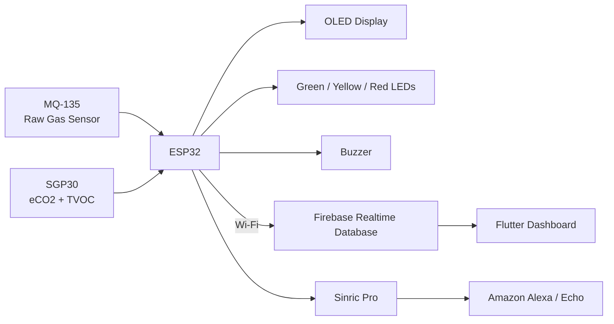

# HomeAir System Architecture

## Data Flow

1. The ESP32 reads the MQ-135 analog signal and SGP30 eCO₂ / TVOC values.
2. Firmware classifies the current state as GOOD, MODERATE, or BAD.
3. The OLED, LEDs, and buzzer provide immediate local feedback.
4. Wi-Fi-connected operation pushes live and historical data to Firebase.
5. The Flutter dashboard reads cloud data for live display and history.
6. Sinric Pro links the ESP32 alert logic to Amazon Alexa.
